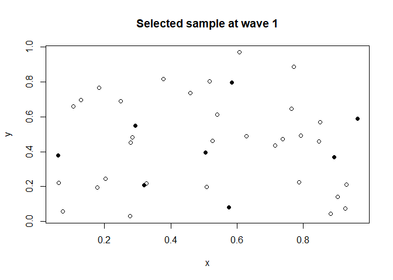
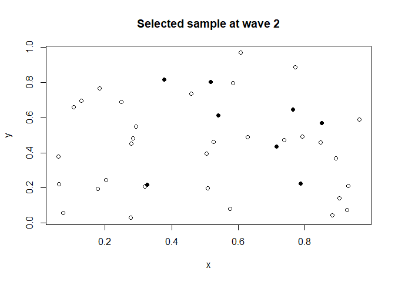
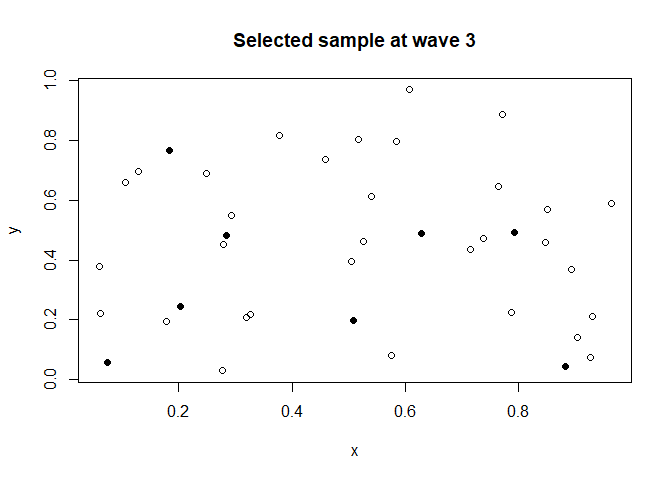

<!-- README.md is generated from README.Rmd. Please edit that file -->

# SpotSampling

[](https://https://travis-ci.org/github/EstherEustache/SpotSampling)

<!-- badges: start -->

<!-- badges: end -->

In spatial data, information of two neighbouring units are generally
very similar. For spatial sampling, it is therefore more efficient to
select samples that are well spread out in space. Often, the interest
lies not only in estimating a measure at one point in time, but rather
in estimating several points in time to also study evolution. Three new
methods called ORFS (Optimal Rotation with Fixed sample Size), ORSP
(Optimal Rotation with SPread sample), and SPOT (SPatial and Optimally
Temporal Sampling) are implemented in this package. ORFS allows to
select temporal samples with fixed size. ORSP select spatiotemporal
samples with random size that are well spread out in space at each point
in time. And SPOT generates spread samples with fixed sample size at
each wave.

## Installation

You can install the released version of SpotSampling from
[CRAN](https://CRAN.R-project.org) with:

    install.packages("SpotSampling")

You can install the latest version of SpotSampling with:

    devtools::install_github("EstherEustache/SpotSampling")

## Example

This is a basic example which shows you how to solve a common problem.
We first consider 20 plots with spatial coordinates and 5 different
points in time. Coordinates are generated randomly with function
`runif`:

``` r
library(SpotSampling)
N     <- 40
T     <- 3
coord <- cbind(x = runif(N), y = runif(N))
head(coord,5)
#>              x         y
#> [1,] 0.9659957 0.6024497
#> [2,] 0.3153598 0.8777810
#> [3,] 0.3540338 0.4688682
#> [4,] 0.3786499 0.9285913
#> [5,] 0.3678536 0.8633033
```

Matrix `pik` of size (20x5) contains temporal inclusion probabilities
for each unit. Columns of  correspond to the waves, and rows correspond
to the units. Inclusion probabilities can be totally unequal. We choose
to generate equal probabilities for all waves (with function `rep`):

``` r
pik <- matrix(rep(0.2, N*T), nrow = N, ncol = T)
head(pik,5)
#>      [,1] [,2] [,3]
#> [1,]  0.2  0.2  0.2
#> [2,]  0.2  0.2  0.2
#> [3,]  0.2  0.2  0.2
#> [4,]  0.2  0.2  0.2
#> [5,]  0.2  0.2  0.2
```

So, we can use the SPOT method with the function `Spot`:

``` r
S <- Spot(pik = pik, coord = coord)
#> 
#> 
#> Beginning of the SPOT method.
#> --------------------------------
#> - Time number 1
#> Sample selection time: 0.1558878
#> - Time number 2
#> Sample selection time: 0.0369041
#> - Time number 3
#> Sample selection time: 0.02094293
#> 
#> Landing phase required for 5 units.
```

We can plot the selected sample at each wave:


